# Evidencias del laboratorio 08

Capturas del caso TechStore tomadas el 7 de octubre de 2026 con el código `e88d831`.
Se ejecutó la misma aplicación en `127.0.0.1:8090`, con una base SQLite temporal,
usuarios `example.test` y productos de demostración. La aplicación Docker de 8088
y sus cuentas reales no se modificaron. No se publican contraseñas, JWT, secretos OAuth ni QR TOTP.

## Registro y autenticación

### Formulario de registro

Solicita nombre completo, correo, tienda y contraseña. Las cuentas nuevas reciben
el rol de ventas; los cambios de rol requieren administrador.

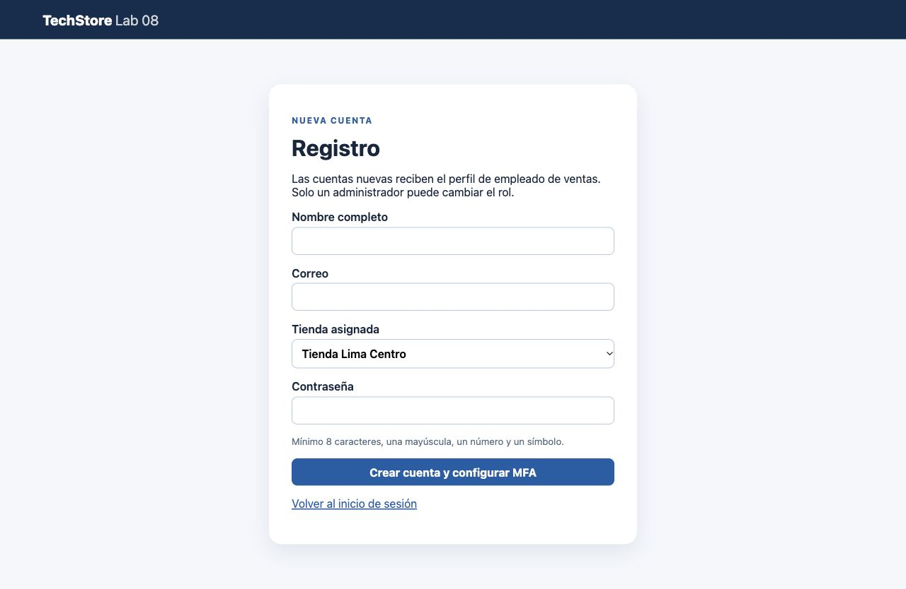

### Contraseña fuerte

Se envió una contraseña de solo minúsculas, de más de ocho caracteres. El servidor
rechazó el registro por no cumplir la complejidad requerida.

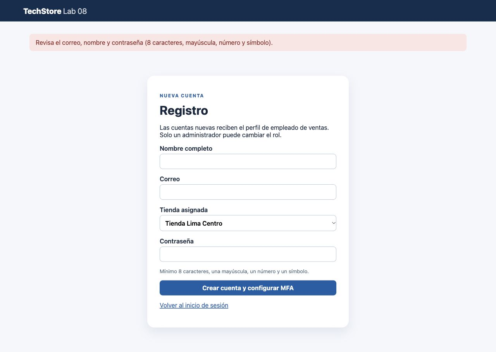

### Correo único

Se intentó registrar nuevamente `admin@example.test` con una contraseña válida.
El servidor rechazó la cuenta duplicada.

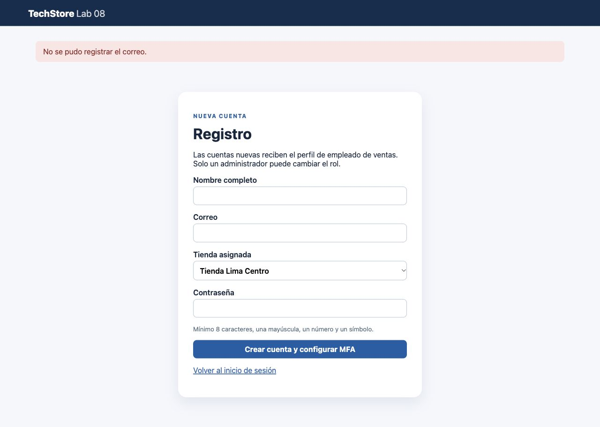

### Login y accesos sociales

Están disponibles el acceso con contraseña y los botones Google y GitHub.
Esta captura acredita la interfaz, no una autorización externa completada.
Las cuentas de demostración no se vincularon con proveedores externos.

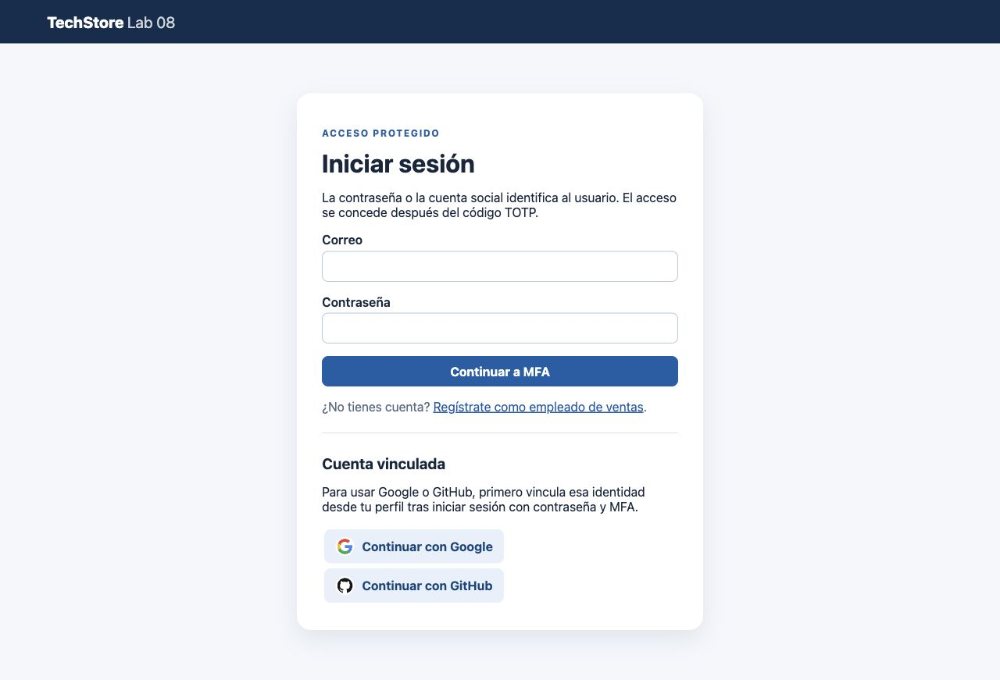

### Segundo factor obligatorio

Después de validar las credenciales se solicita el código de seis dígitos antes de
entrar al inventario. Se eligió la opción A del enunciado: TOTP, con intervalos de
30 segundos. El QR se omite porque contiene la clave del segundo factor.
La prueba `test_registration_restricts_role_and_enrolls_totp` verifica registro,
activación TOTP y acceso a la API con JWT después de MFA.

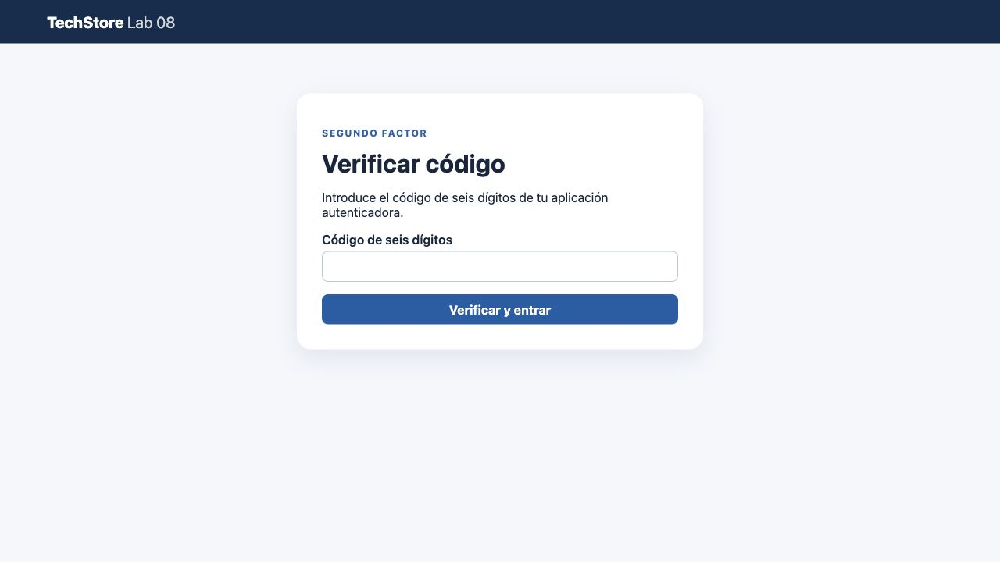

## Roles y permisos

### Administrador del sistema

Visualiza productos de ambas tiendas y tiene controles de creación, edición,
stock y eliminación. La insignia indica acceso posterior a MFA; la validación
del JWT se comprueba en las pruebas, no solo mediante ese texto de la interfaz.

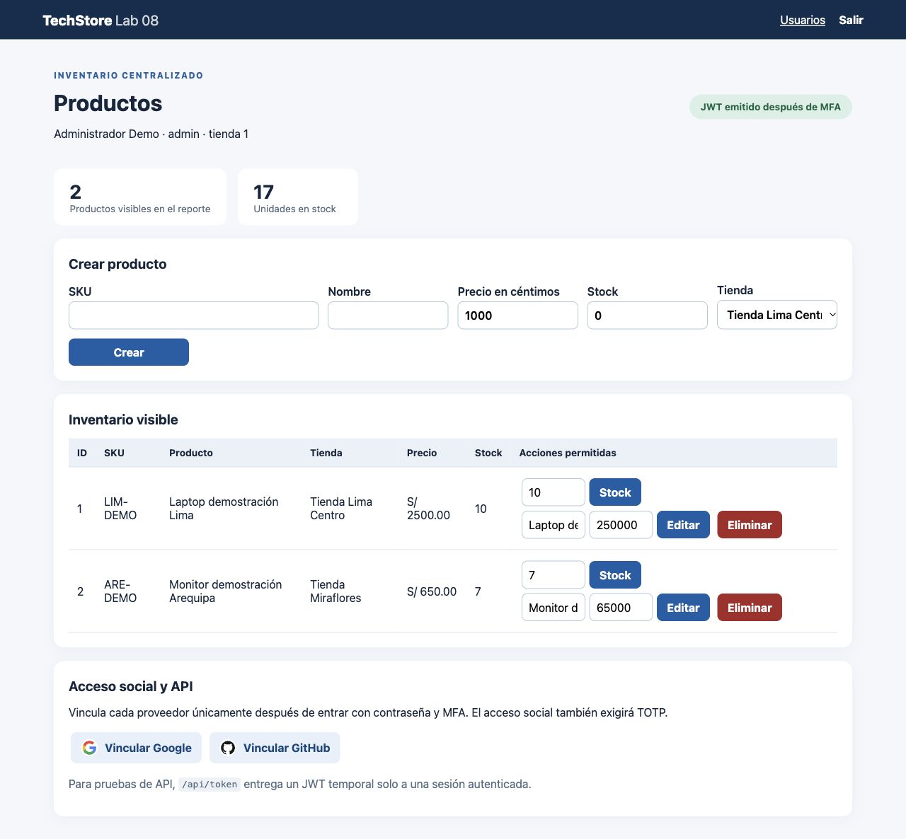

### Gestión de usuarios

El administrador puede asignar roles y tiendas. La revocación de JWT anteriores
se verifica con `test_admin_changes_revoke_old_jwt`.

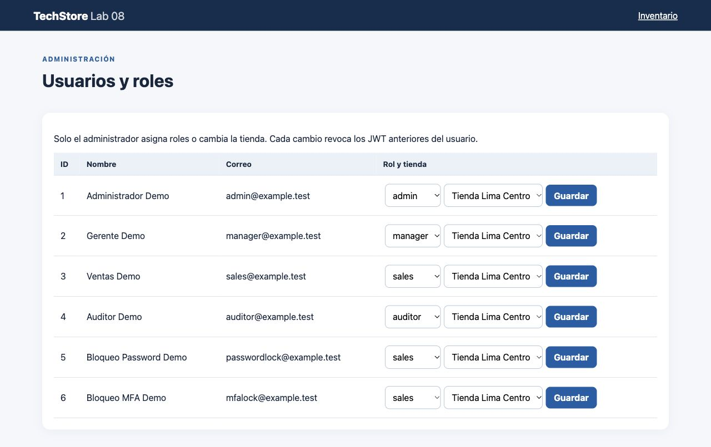

### Gerente de tienda

Solo visualiza el producto de su tienda, Lima Centro. La suite comprueba también
que eliminar un producto de otra tienda por API devuelve 403.

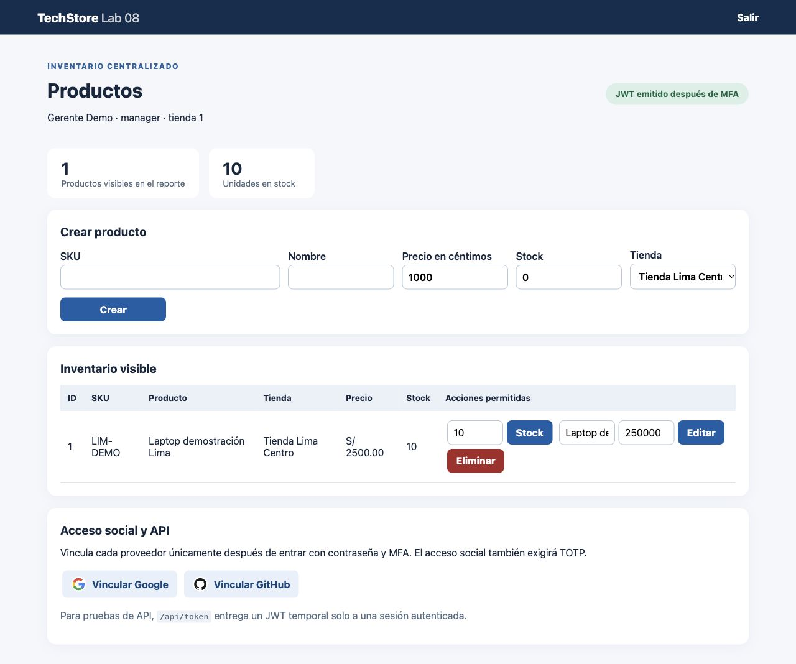

### Empleado de ventas

Se actualizó el stock de 10 a 12 unidades. No hay controles para modificar precios
ni eliminar. Las pruebas verifican el rechazo de esas operaciones por API.

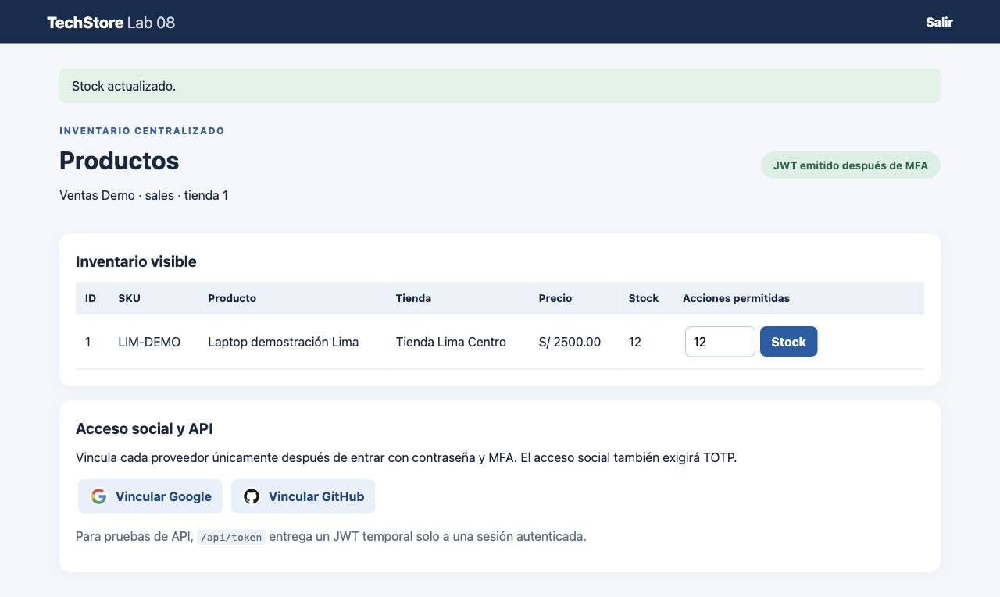

### Auditor

Visualiza ambas tiendas y el resumen de inventario, con acciones de solo lectura.
La suite comprueba reportes de ambas tiendas y rechazo de modificaciones por API.

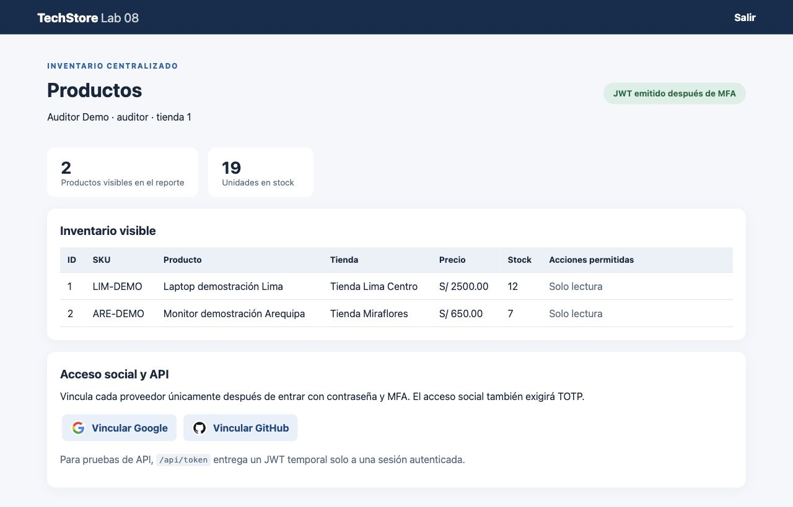

## Bloqueos

### Cinco contraseñas incorrectas

Después de cinco intentos fallidos se volvió a intentar con la contraseña correcta.
La cuenta temporal permaneció bloqueada.

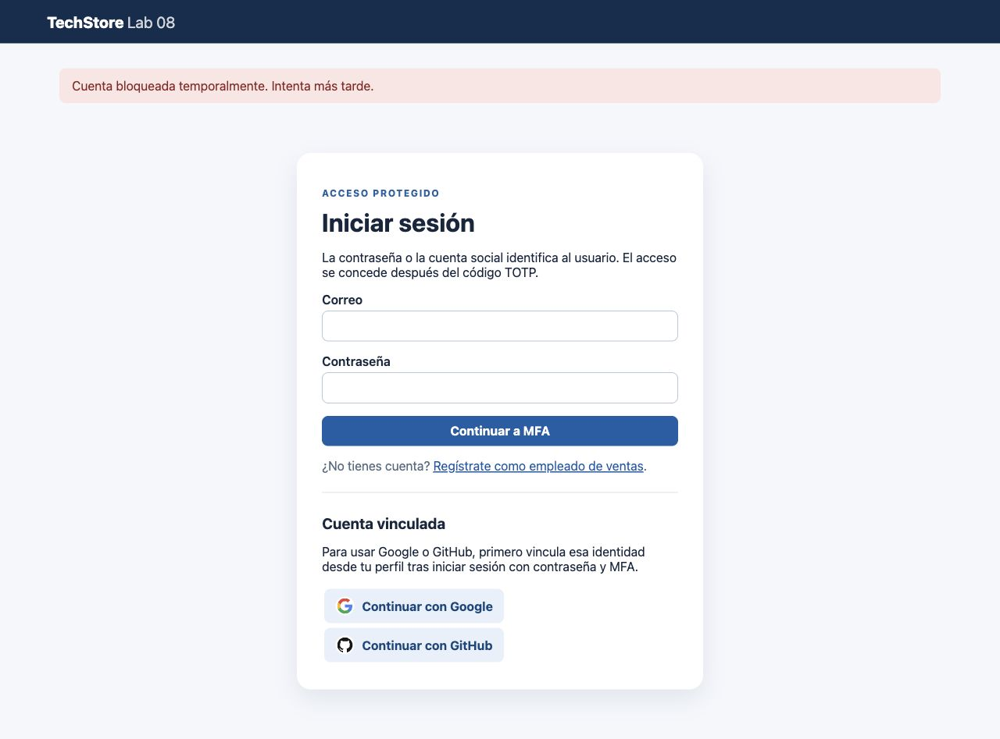

### Tres códigos MFA incorrectos

Después de validar la contraseña de otra cuenta temporal, se enviaron tres códigos
incorrectos. El sistema regresó al login mostrando el bloqueo.

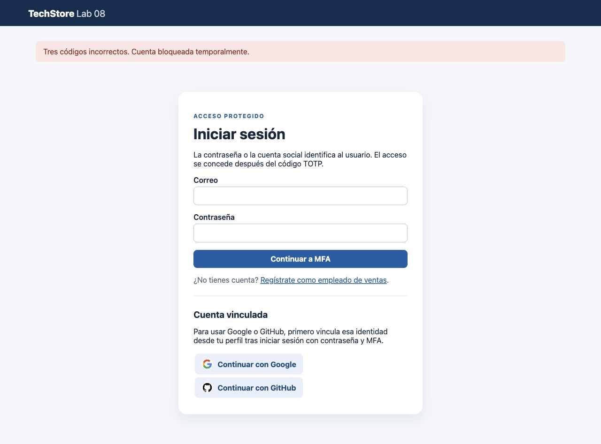

## Pruebas automatizadas

Salida real de 14 pruebas: permisos por rol y tienda, JWT posterior a MFA,
ausencia de acceso antes de MFA, revocación JWT, prevención de reutilización TOTP,
CSRF y cambio de identidad social. OAuth usa respuestas simuladas en estas pruebas;
no acredita una autorización externa real.

```bash
.venv/bin/python -m unittest discover -s tests -v
```

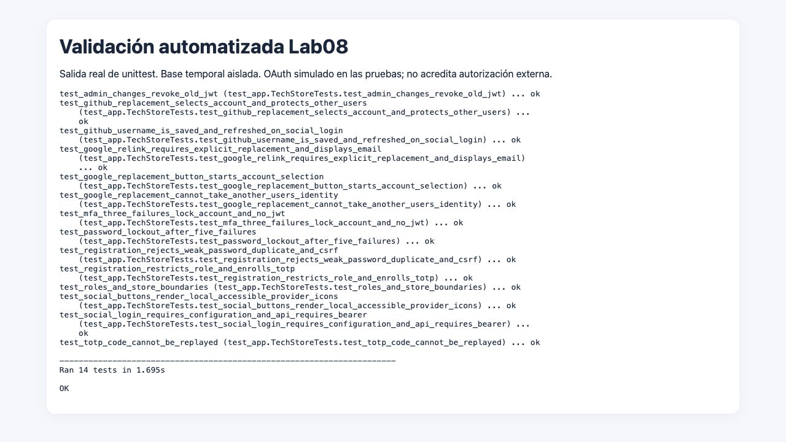

## Alcance

Las capturas documentan la aplicación y pruebas locales, no un despliegue AWS.
No incluyen cuentas reales ni consentimientos de Google/GitHub, por privacidad.
Para acreditar visualmente el flujo social completo, faltan capturas con una cuenta
de demostración autorizada para publicación. Los tokens completos y QR deben seguir privados.

## Conclusiones

La autenticación y MFA identifican al usuario antes de conceder acceso; el rol y
la tienda limitan después sus operaciones. Los controles deben aplicarse en el
servidor: ocultar botones no sustituye el rechazo de peticiones no autorizadas.
Los bloqueos y la prevención de reutilización TOTP complementan esas protecciones.
